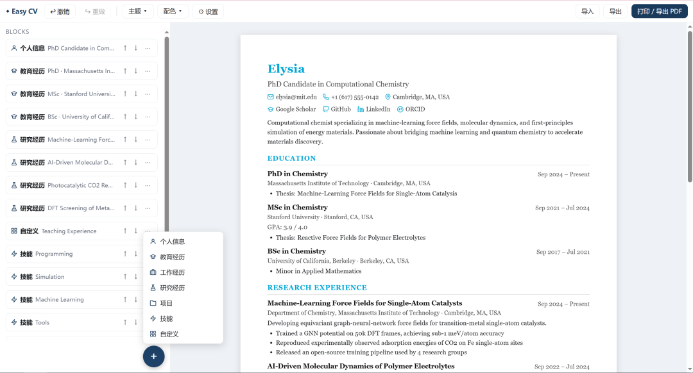
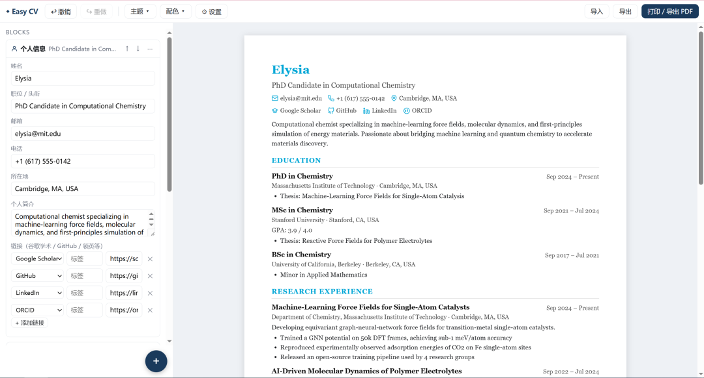
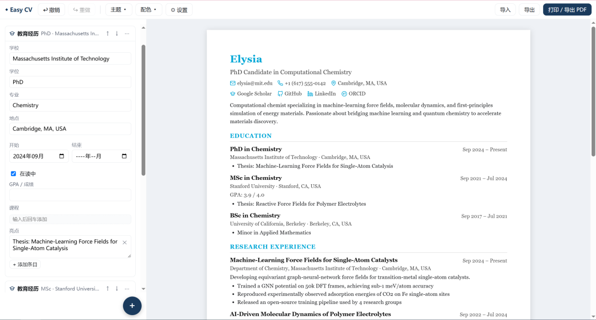
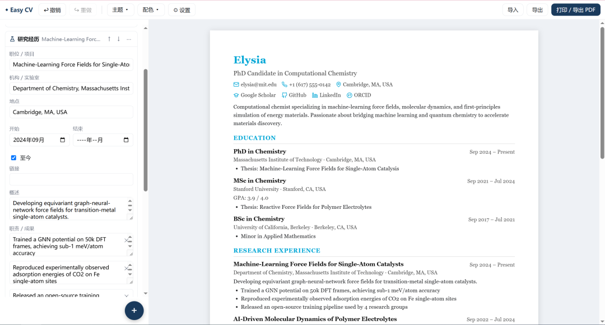
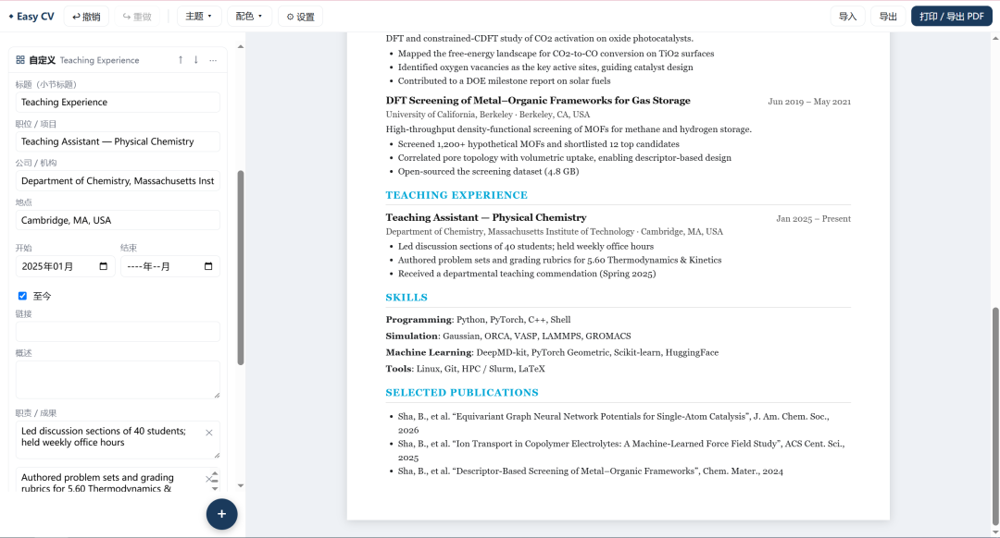
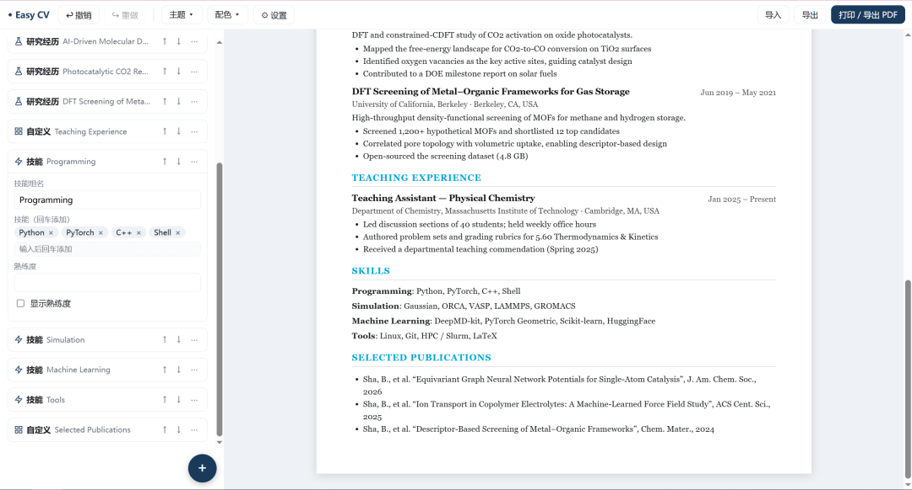
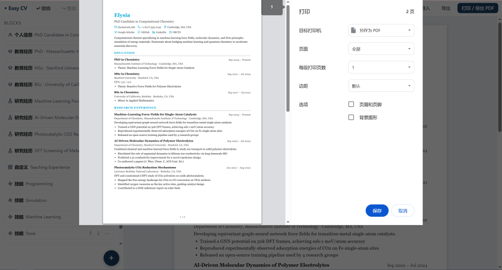

# Easy CV —— 简历块编辑器

一个**块式** CV 编辑器：左侧编辑块（点 `+` 添加）、右侧实时预览，`Ctrl+P` 直接导出 PDF。打开即用、零安装、离线可用。

## 📖 公众号推文

这个工具的来龙去脉和功能演示，发在公众号上，想先看效果可以直接读这两篇：

1. **[EasyCV，一款轻量级的简历工具](https://mp.weixin.qq.com/s/kfRMGOUBfN_SwicK2ABO2Q)**（2026-08-03）—— 工具缘起与基础功能：添加模块、个人信息、教育经历、研究经历、自定义模块、技能、导出 PDF
2. **[EasyCV增量更新](https://mp.weixin.qq.com/s/-V9Gu0izmO2vdLUW2sbpTg)**（2026-09-16）—— 新增功能：简历照片、自定义信息（籍贯 / 政治面貌等）

下面的《使用指南》就是把这两篇按顺序合并整理成的图文版。

## 快速开始

直接双击 `index.html`（用 Chrome / Edge 打开效果最佳）。首次打开会载入一份示例简历。

> 用普通 `<script>` 按顺序加载（非 ES module），所以 **`file://` 双击即可运行**，不需要服务器、不需要构建。

## 使用指南

### 1. 添加模块

点右下角的 `+`，弹出可选模块列表：**个人信息 / 教育经历 / 工作经历 / 研究经历 / 项目 / 技能 / 自定义**。选一个即可添加。



每个块都是「左边表单、右边预览」：改动即时反映到中间预览，不用点保存。块的排序 / 复制 / 删除在块标题右侧 `↑ ↓ ⋯`。

### 2. 个人信息

`个人信息` 块是整个简历的头部，包含姓名、职位 / 头衔、邮箱、电话、所在地、个人简介。



**链接**：除了常用信息，还可以添加谷歌学术、ORCID、GitHub、领英等——每行一条，左边选类型、右边填网址。

#### 自定义信息 + 照片


**自定义信息**是一组自由键值对，用来放模板没预设的字段，显示在头衔下方。比如：

```
籍贯：上海    政治面貌：群众    最高学历：博士    年龄：秘密
```

名称和内容都自己填，**没有预设类型**；留空的条目会自动跳过。宽度不够时整条一起换行，不会把「名称：内容」拆开。

**照片**：勾选「显示照片」并选择图片，照片会显示在 CV 右上角（30×40mm，3:4，自动居中裁切不变形）。

- 图片自动缩到 400px 内嵌进 JSON，**不依赖外部文件**，导出 / 导入不会丢
- 勾了但还没选图时会显示一个**虚线占位框，并且会打印出来** —— 这是故意的：纸上看到框才知道自己忘了放照片

### 3. 教育经历

可填学校、学位、专业、地点，以及起止时间。



- 勾选「在读中」会把结束时间显示成「至今」
- 除了大学，还能写**获奖信息**（填在「亮点」里，每行一条）
- 「课程」字段每行一门

### 4. 研究经历

适合写科研项目：职位 / 项目名称、机构 / 实验室、地点、起止时间（勾「至今」表示进行中）、链接。



「概述」写项目整体介绍，「职责 / 成果」每行一条，适合放论文产出、开源项目这类可以量化的工作。

### 5. 自定义模块

模板满足不了的内容（教学经历、志愿服务、专利……）直接用自定义块。标题（小节标题）自己填，其余字段与内置块一致，同样排进右侧预览的正文流里。



### 6. 技能

「技能名」+「技能（回车添加）」标签，比如 `Programming` → `Python` `PyTorch` `C++` `Shell`。



勾上「显示熟练度」才会显示熟练度那一行，不需要就留空。

### 7. 导出 PDF

编辑完点右上角 **`打印 / 导出 PDF`**（或 `Ctrl+P`），在打印对话框里选「另存为 PDF」保存到本地。



⚠️ 打印对话框里请**取消勾选「页眉和页脚」**，否则会带出日期和页面标题（浏览器限制，CSS 无法去除）。

### 8. 保存与恢复

> **强烈建议编辑过程中随时导出 JSON 备份**，以防电脑死机导致进度丢失。

- **`Ctrl+S` 导出 JSON**：Chrome/Edge 下第一次让你选一次保存位置（建议选项目文件夹），之后自动静默存到同一文件；Firefox 无此 API，退回普通下载
- **自动保存**：数据自动存到浏览器 `localStorage`（按文件路径隔离）
- **`导入`**：支持应用 JSON 与 JSON Resume 两种格式

万一进度丢了，把之前导出的 JSON 重新导入即可恢复。

## 其他操作

- **加粗**：任意文字字段里用 `**文字**` 即可加粗（姓名、头衔、技能、职责、自定义信息……全都支持）。渲染时先转义再加粗，所以不会引入 HTML 注入
- **主题**：经典（衬线）/ 现代（无衬线）——只影响字体
- **配色**：5 个专业预设色（藏青/青绿/墨绿/酒红/深紫，**锁定不可改**）/ 输入色号（支持 `#RGB`、`#RRGGBB`、`rgb(r,g,b)`，回车即应用）/ 「+ 添加」存成自定义色块（**右键可修改/删除**，预设不可）/ 🎲 随机生成配色（主题色独立于字体，写入 JSON）

## 目录结构

```
easy_cv/
├── index.html          入口（壳 + 菜单/弹层标记 + 模块加载）
├── css/style.css       全部样式（含 @media print 打印样式）
├── js/
│   ├── utils.js        工具函数 + 内联 SVG 图标
│   ├── photo.js        照片：data URL 校验 + canvas 缩放管线
│   ├── blocks.js       块类型注册表 + 预览渲染函数
│   ├── themes.js       主题配置
│   ├── store.js        StateStore（数据源/历史/undo）+ JSON Patch
│   ├── render.js       预览渲染（预览 DOM 即打印对象）
│   ├── editor.js       编辑器 UI（表单字段、tags/links 子组件、弹层）
│   ├── export.js       导出/导入/打印/设置 + JSON Resume 映射
│   ├── sample.js       示例数据
│   └── boot.js         事件绑定 + 启动
├── screenshots/        本文档的配图（取自公众号推文）
├── sample-cv.json      示例数据（可作导入夹具）
├── fake.json           演示用假数据（除姓名外均为虚构，联系方式不可用）
├── fake-cv.pdf         上面那份演示数据导出的 PDF，用于比对排版效果
├── skills/
│   └── convert-cv-to-easycv/SKILL.md   Claude Code skill：把任意格式简历转成 EasyCV JSON
├── CV_JSON_SPEC.md     JSON 字段与格式规范（供 AI / agent 阅读复用）
├── test.js             冒烟测试（Node：node test.js）
└── test-checklist.md   端到端人工验证清单
```

## AI 集成方式（不在应用内做 AI）

应用**不内置 AI 对话**（已砍掉，避免重复造轮子）。AI 能力通过两种方式使用：

1. **Agent / skill**：仓库里已经带了 `skills/convert-cv-to-easycv/`——把 PDF / DOCX / HTML / Markdown 等任意格式的简历丢给它，转成 EasyCV 能导入的 JSON。也可以照它的样子自己写 skill，读 `CV_JSON_SPEC.md` 了解字段与格式，直接编辑 `*.json`（再导入应用）。这是"改文件"式 agent 的推荐做法。
2. **对话式 AI**：把 `CV_JSON_SPEC.md` 发给任意 AI，让它生成/修改 JSON，再导入应用。

**`CV_JSON_SPEC.md` 是唯一需要维护的"AI 接口"**——它完整描述了字段、值格式、JSON Patch 路径和 JSON Resume 映射。

## 已知限制 / 注意事项

- **localStorage 按文件路径隔离**：移动 `index.html` 到别的路径会"丢"草稿（旧数据仍在旧路径下），用导出/导入兜底
- **Safari 可能禁用 file:// 下的 localStorage**：会提示用导出 JSON 手动保存
- **Firefox 打印**：不支持 `@page` 页脚页码（无页号），内容照常打印；Chrome/Edge 完整支持页码
- **打印保真**：多页时用 `@page` 边距而不是元素 padding，第 2 页起边距正常
- **ATS 解析**：单栏、真实文本、标准标题，ATS 友好
- **中文**：预览/打印用系统字体（Windows 微软雅黑 / 宋体），免费支持，无需打包字体
